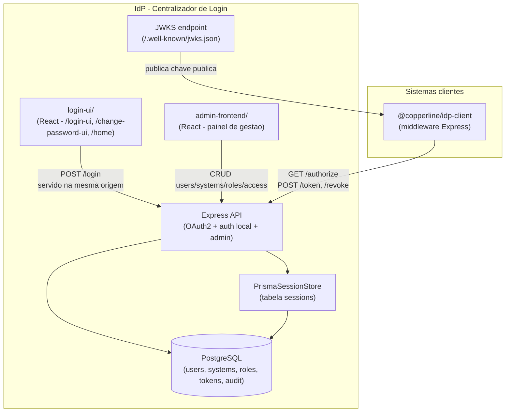

# Arquitetura

## Componentes principais



- **API Express** ([src/app.ts](../src/app.ts)): sessão local (`express-session` +
  `PrismaSessionStore`), rotas de autenticação local, OAuth2 Authorization
  Code, JWKS e administração.
- **login-ui/**: telas públicas de autenticação (`/login-ui`,
  `/change-password-ui`, `/home`), React + Vite, **servida pelo próprio
  backend na mesma origem** (`src/lib/publicAuthUi.ts`) — evita CORS e
  problema de cookie cross-site no `POST /login`.
- **admin-frontend/**: painel de gestão (usuários, sistemas, papéis,
  acessos, auditoria), React + Vite, SPA separada consumindo a API via
  proxy de dev.
- **PrismaSessionStore** ([src/lib/sessionStore.ts](../src/lib/sessionStore.ts)):
  `Store` customizado do `express-session` sobre a tabela `sessions` do
  próprio Prisma — mesma base/migrations do resto do schema, sem depender
  de uma tabela criada por fora do Prisma (ex.: `connect-pg-simple`).
- **JWKS**: endpoint público que expõe a chave pública RSA atual — sistemas
  clientes validam a assinatura do JWT localmente, sem chamar o IdP a cada
  request autenticado.

## Estrutura de pastas

```
src/
├── controllers/   camada HTTP - le req, monta DTO, chama o Service, monta a resposta. Nunca contem regra de negocio.
├── services/      toda a logica de negocio (hash, tokens, RBAC, auditoria). Nao conhece Request/Response, so chama repositories/.
├── repositories/  unico lugar que fala com o Prisma Client - um por entidade principal.
├── dtos/          formato de entrada/saida entre camadas, validado com zod na fronteira. DTO de saida nunca inclui campo sensivel.
├── middlewares/   sessao, rate limit, gate de troca de senha obrigatoria.
├── routes/        so liga rota (metodo + path) -> controller.
├── errors/        DomainError e subclasses - o handler global (src/app.ts) traduz pra status/corpo HTTP.
└── prisma/        instancia unica do PrismaClient (so repositories/ e o Store de sessao a importam).
```

## Decisões de design

- **Sem pasta `entities/`** — os Services/Repositories usam os tipos
  gerados pelo Prisma Client diretamente (`User`, `System`, etc.) como
  Entity. Pragmático pro tamanho atual do projeto; o desacoplamento total
  de uma Entity própria só compensaria com um plano real de trocar de ORM,
  o que não é o caso aqui.
- **`PrismaSessionStore` é a única exceção documentada** à regra "só
  `repositories/` fala com o Prisma": ela implementa infraestrutura de
  sessão (contrato de `Store` do `express-session`), não uma consulta de
  domínio.
- **`DomainError` + handler global único** ([src/app.ts](../src/app.ts)):
  Services lançam subclasses de `DomainError` (status + código); Controllers
  nunca decidem status/corpo HTTP para esses casos — só o handler de erro
  global traduz. Mantém a tradução de erro num único lugar em vez de
  espalhada em cada Controller.
- **`PrismaSessionStore` sobre `connect-pg-simple`**: uma tabela a menos
  fora do controle das migrations do Prisma — sessão do IdP faz parte do
  mesmo schema versionado que o resto dos dados.
- **JWT com RS256 (assimétrico), não HS256**: a chave privada nunca sai do
  IdP; sistemas clientes só precisam da chave **pública** (via JWKS) para
  validar — não haveria como distribuir um segredo simétrico com segurança
  para dezenas de sistemas clientes sem esse segredo virar, na prática,
  público.
- **Refresh token com rotação e detecção de reuso**: ver
  [SEGURANCA.md](./SEGURANCA.md#tokens) e [FLUXOS_OAUTH2.md](./FLUXOS_OAUTH2.md).

## Fluxos de negócio (visão geral)

1. **Autenticação local**: `POST /login` → valida credenciais → sessão
   própria do IdP (cookie `idp.sid`).
2. **OAuth2 Authorization Code**: `GET /authorize` → (login se necessário)
   → `code` → `POST /token` → `access_token` (JWT RS256) + `refresh_token`.
   Detalhado em [FLUXOS_OAUTH2.md](./FLUXOS_OAUTH2.md).
3. **Refresh**: `POST /token` com `grant_type=refresh_token` → rotaciona o
   token, reconfere acesso ativo.
4. **Revogação**: `POST /revoke` (RFC 7009) — usado no logout dos sistemas
   clientes.
5. **Troca de senha obrigatória**: middleware `blockIfMustChangePassword`
   bloqueia qualquer rota de gestão até a senha temporária ser trocada.

## Dependências externas

Nenhuma — o IdP é intencionalmente isolado (Postgres próprio, rede Docker
própria `idp-net`, sem chamada a serviço externo). Sistemas clientes
dependem *dele*, não o contrário.
