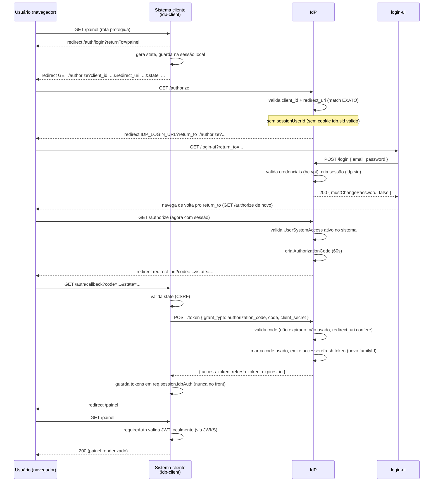
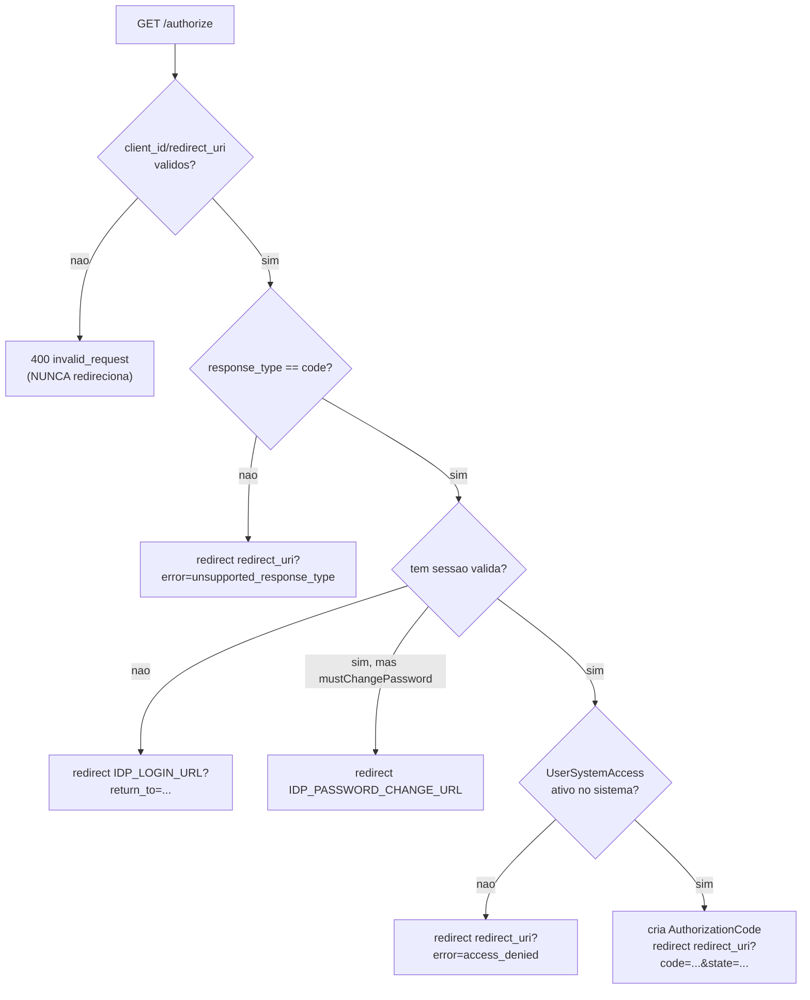
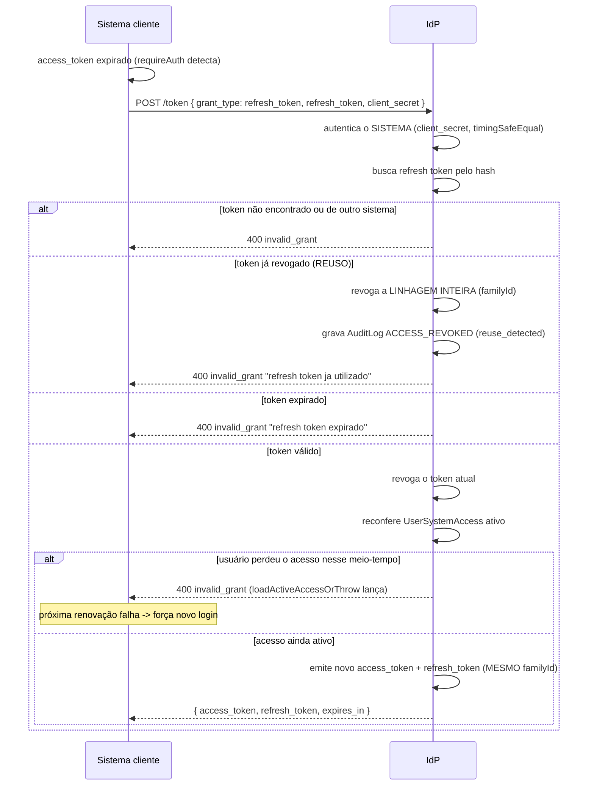
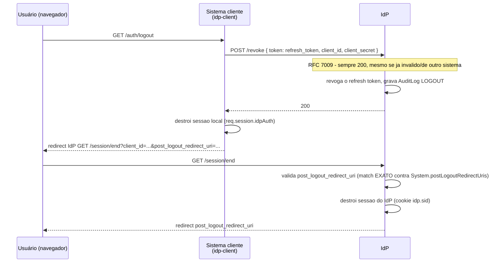

# Fluxos OAuth2

Diagramas de sequência refletindo o comportamento real de
[src/services/oauth.service.ts](../src/services/oauth.service.ts) — não um
fluxo OAuth2 genérico de livro-texto.

## 1. Authorization Code — caminho feliz (sem sessão prévia)

## 2. Casos especiais de `GET /authorize`

A distinção entre "erro antes de confiar no `redirect_uri`" (400 direto,
`C`) e "erro depois" (redirect com `?error=`, `E`/`J`) é deliberada — ver
[SEGURANCA.md](./SEGURANCA.md#validação-de-redirect_uri--post_logout_redirect_uri).

## 3. Renovação de token (`grant_type=refresh_token`)

## 4. Logout (RP-Initiated Logout)

Sem o passo `/session/end`, o SSO reautenticaria silenciosamente no próximo
`/authorize` (a sessão do IdP ainda existiria) — o usuário nunca veria a
tela de login de novo, mesmo achando que saiu.

## Referências

- Implementação real: [src/services/oauth.service.ts](../src/services/oauth.service.ts)
- Claims e validação do JWT: [validacao-de-token.md](./validacao-de-token.md)
- Uso do SDK: [CLIENT_SDK.md](./CLIENT_SDK.md)
