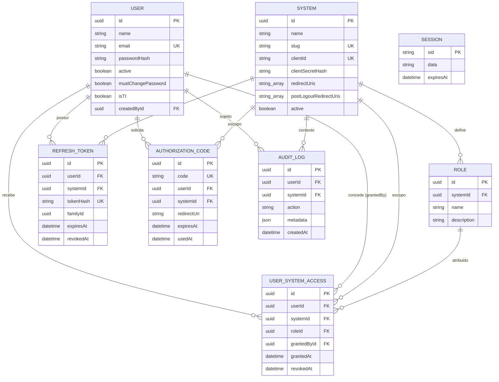

# Banco de Dados

Schema completo, comentado por entidade, em
[prisma/schema.prisma](../prisma/schema.prisma) — esta página resume e
ilustra as relações. **Fonte de verdade é o arquivo `.prisma`**, não esta
página, em caso de divergência.

## Diagrama ER

> `SESSION` não tem FK pro resto do schema de propósito — guarda a sessão
> `express-session` serializada como JSON (`data`), não um relacionamento de
> domínio.

## Tabelas

| Modelo | Papel |
|---|---|
| `User` | Usuários cadastrados por TI (sem self-service). Nunca deletado fisicamente — `active=false` para desativar. Campos de auth: `mustChangePassword`, `isTI`. |
| `System` | Cada sistema interno (client OAuth2) que consome o IdP: slug, `clientId`/`clientSecretHash`, `redirectUris`, `postLogoutRedirectUris`. |
| `Role` | Papel dentro de um sistema específico (não é global). Único por `(systemId, name)`. |
| `UserSystemAccess` | Concessão de acesso usuário→sistema com um papel. Revogação via `revokedAt` (nunca delete). Um acesso ativo por `(userId, systemId)`, garantido por índice único parcial (`WHERE revoked_at IS NULL`), adicionado na migration `add_active_user_system_access_unique`. |
| `RefreshToken` | Token de sessão por sistema, com `familyId` agrupando a linhagem de tokens rotacionados (detecção de reuso). Só o hash (SHA-256) é armazenado. |
| `AuthorizationCode` | Código de uso único do Authorization Code Flow, vida curta (60s padrão), `usedAt` marca o resgate. |
| `AuditLog` | Trilha de auditoria centralizada. `userId`/`systemId` opcionais (nem toda ação tem os dois). Ações: `LOGIN_SUCCESS`, `LOGIN_FAILED`, `LOGOUT`, `SYSTEM_ACCESS`, `ACCESS_GRANTED`, `ACCESS_REVOKED`, `USER_CREATED`, `USER_UPDATED`, `PASSWORD_CHANGED`, `TOKEN_ISSUED`. |
| `Session` | Sessão local do IdP, usada pelo `PrismaSessionStore` customizado do `express-session`. |

## Índices críticos

Todos em campos consultados a cada request de autenticação:

- `User.email` — busca no login
- `System.slug`, `System.clientId` — validação de OAuth2
- `RefreshToken.tokenHash` — busca segura na renovação/revogação
- `AuthorizationCode.code` — troca do code por token
- `UserSystemAccess (userId, systemId)` (índice único parcial, ativo) — checagem de acesso a cada `/authorize` e a cada rotação de refresh token
- `AuditLog.userId`, `AuditLog.systemId`, `AuditLog.action` — consultas da tela de auditoria

## Soft delete vs. hard delete

| Entidade | Política | Motivo |
|---|---|---|
| `User` | Soft (`active=false`) | Histórico de auditoria precisa continuar referenciando o usuário |
| `System` | Soft (`active=false`) | Idem — tokens/códigos antigos e logs continuam válidos como registro |
| `UserSystemAccess` | Soft (`revokedAt`) | Trilha completa de quem teve acesso a quê e quando |
| `RefreshToken` | Soft (`revokedAt`) | Necessário para detectar reuso de token já revogado |
| `Role` | **Hard delete** | Não faz parte da trilha de auditoria por si só — mas é bloqueado (409) se algum `UserSystemAccess` (ativo ou histórico) ainda referenciar o papel |
| `AuthorizationCode` | Nem soft nem hard — `usedAt` marca resgate, e a linha expira naturalmente (TTL curto, 60s) | Vida útil curta demais para justificar preservação |

Regra geral: **nada que alimente auditoria é deletado fisicamente.**
