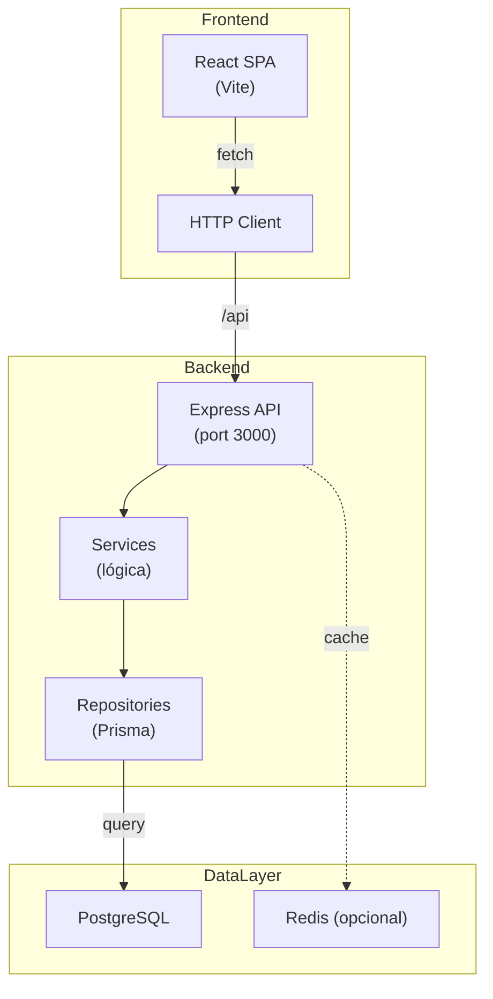
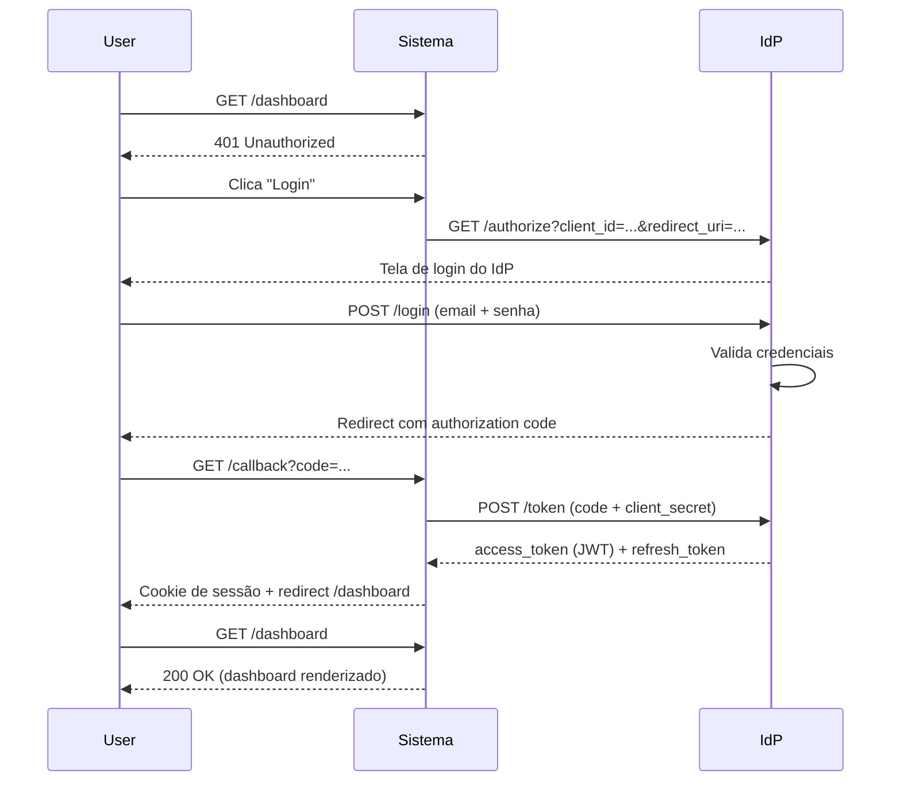
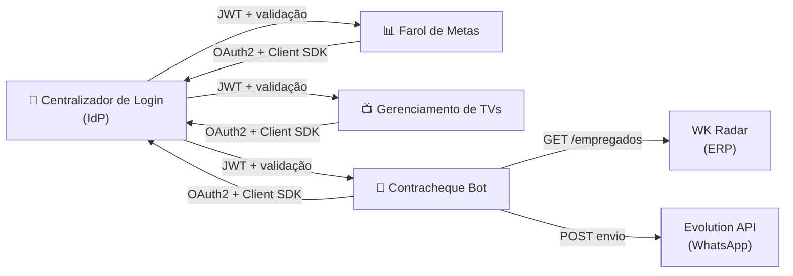
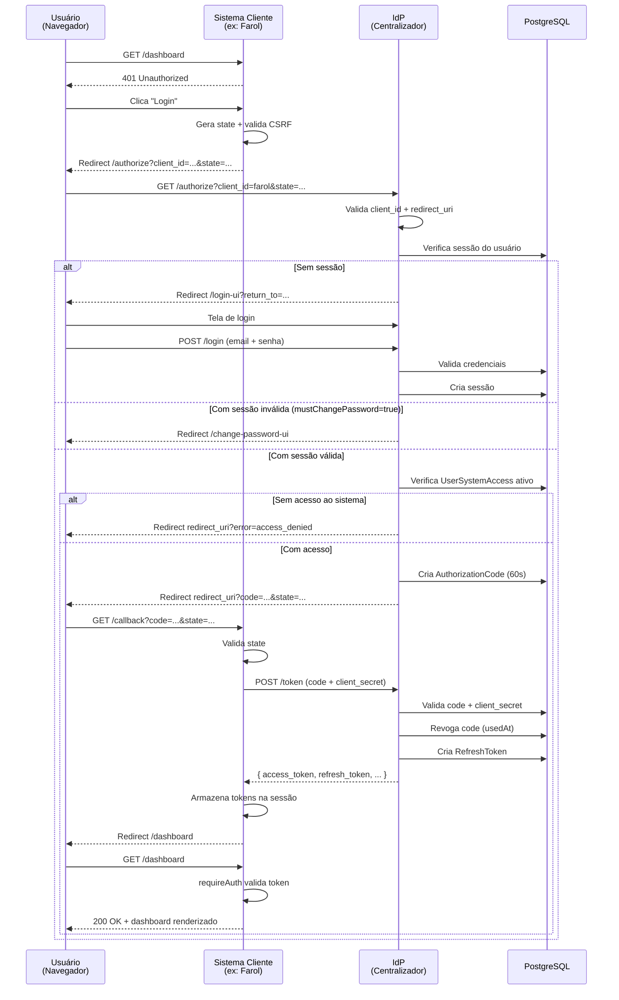
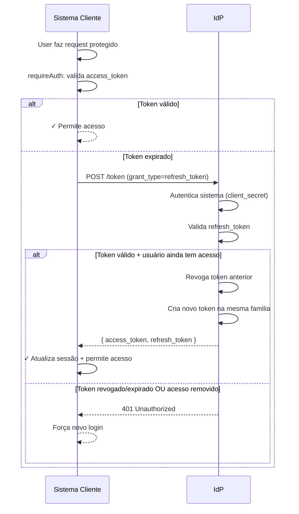
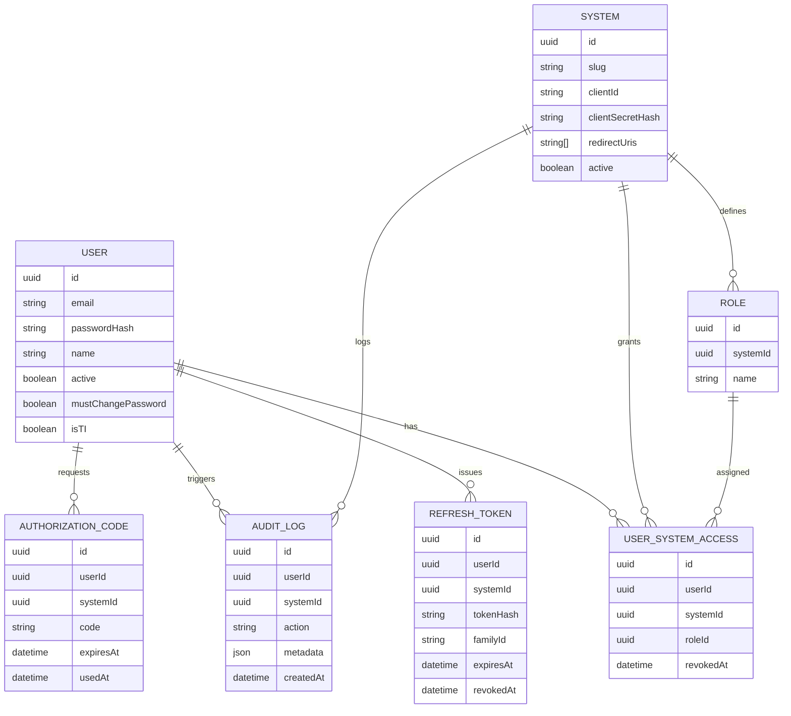
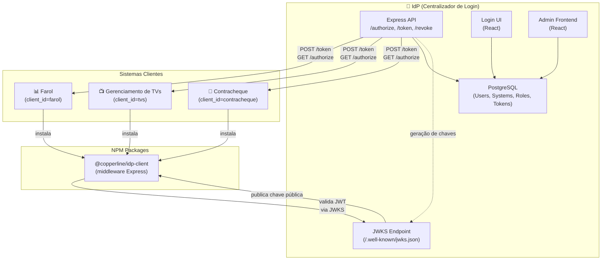

# Ordem de Serviço: Documentação de Sistemas Interconectados

**Versão:** 1.0  
**Data de Emissão:** Agosto de 2026  
**Status:** A Executar  
**Prioridade:** Alta

---

## 1. Objetivo Geral

Atualizar e reformular a documentação de 4 sistemas interconectados que residem no mesmo workspace do VSCode, consolidando informações desatualizadas nos READMEs remotos e criando uma documentação integrada com diagramas de arquitetura, fluxos de autenticação, prints de interfaces e instruções operacionais claras.

---

## 2. Escopo de Trabalho

### 2.1 Sistemas a Documentar

| Sistema | Repositório Local | Responsabilidade | Stack |
|---------|-------------------|-------------------|-------|
| **Centralizador de Login (IdP)** ⭐ | `Centralizador-de-login/` | Autenticação centralizada, OAuth2, JWT, gerenciamento de usuários/papéis, emissão de JWKS | Node.js + Express + TypeScript + Prisma + PostgreSQL |
| **Farol de Metas** | `Farol-de-Metas/` | Acompanhamento de indicadores (IC/IV), metas, realizados, dashboards e relatórios | Node.js + React + TypeScript + Prisma + PostgreSQL |
| **Gerenciamento de TVs** | `Gerenciamento-de-tvs/` | Gerenciamento de displays, upload de vídeos, RBAC local, autenticação | Node.js + Express + Prisma + PostgreSQL |
| **Contracheque Bot** | `contracheque-bot/` | Automação de envio de contracheques via WhatsApp, integração com WK Radar e Evolution API | Node.js + React + Express + BullMQ + Redis + PostgreSQL |

> **⭐ Nota Importante sobre IdP:**  
> O IdP é um componente crítico e reutilizável que pode ser promovido a um **repositório separado** (veja seção 3.3 abaixo).  
> Isso facilitaria versionamento, consumo como biblioteca e escalabilidade futura.

### 2.2 Entregáveis Esperados

Para **cada sistema**, gerar:

1. **README.md atualizado** com:
   - Descrição clara do propósito
   - Stack de tecnologias
   - Pré-requisitos
   - Instruções de setup local (sem Docker e com Docker)
   - Variáveis de ambiente reais (não desatualizadas)
   - Estrutura de pastas comentada
   - Screenshots de interfaces principais (mínimo 2 por sistema)
   - Endpoints/rotas principais documentadas

2. **Diagramas** em formato SVG ou Markdown (Mermaid):
   - **1 Diagrama de Arquitetura** (componentes e como se comunicam)
   - **1 Diagrama de Fluxo de Autenticação** (como passa pela autenticação centralizada)

3. **Documentação de Integração**:
   - Como o sistema se comunica com o IdP
   - Como instalar e usar o `idp-client` SDK
   - Exemplo de uso do OAuth2 flow

---

## 3. Requisitos & Informações Iniciais

### 3.1 Informações sobre os Sistemas (resumo)

**Centralizador de Login (IdP)**
- Principal: autenticação centralizada para todo o ecossistema
- Fluxo: OAuth2 Authorization Code + JWT (RS256)
- Refresh token com rotação
- Painel administrativo em React
- Interface pública de login também em React
- Client SDK (idp-client) reutilizável por outros sistemas

**Farol de Metas**
- Dashboard de indicadores de desempenho
- Hierarquia IC (Indicador de Controle) → IV (Indicadores de Verificação)
- Metas e realizados mensais com histórico
- Cálculo automático de acumulados
- Comparativo entre anos/setores
- Auditoria completa

**Gerenciamento de TVs**
- Sistema de displays/TVs
- Upload de vídeos com Multer
- RBAC (controle de acesso por papel)
- Integração com IdP para autenticação

**Contracheque Bot**
- Automação de envio de contracheques via WhatsApp
- Sincroniza funcionários do WK Radar (ERP)
- Processa PDFs, valida, envia via Evolution API
- Dashboard com indicadores e progresso em tempo real (SSE)
- BullMQ + Redis para fila de jobs
- Worker separado para envio assíncrono

### 3.2 Características Compartilhadas

- Todos rodam em Docker Compose localmente
- Todos usam PostgreSQL
- Todos (exceto Gerenciamento de TVs) usam o Client SDK do IdP
- TypeScript (backend) + TypeScript ou JavaScript (frontend)
- Vite para build do frontend
- Prisma como ORM

### 3.3 ⭐ NOVO: Repositório Separado para IdP (Recomendação)

**Proposta:** Separar o IdP em um repositório independente (`@copperline/idp` ou similar)

#### Rationale

1. **Versionamento independente**: IdP evolui em seu próprio ciclo, não vinculado aos sistemas cliente
2. **Reutilização clara**: O `idp-client` SDK fica como um pacote npm publicável
3. **Documentação centralizada**: Guia único de como implementar/estender o IdP
4. **Escalabilidade**: Permite que múltiplas instâncias/versões do IdP coexistam
5. **Manutenção**: Separar concerns entre "provedor de identidade" e "consumidor de identidade"

#### Estrutura Proposta

```
idp/  (novo repositório)
├── src/                      # Backend do IdP
│   ├── controllers/
│   ├── services/
│   ├── repositories/
│   ├── middlewares/
│   ├── routes/
│   └── app.ts
├── login-ui/                 # Interface de login (React)
├── admin-frontend/           # Painel administrativo (React)
├── idp-client/               # SDK reutilizável (npm package)
│   ├── src/
│   │   ├── middleware/
│   │   ├── jwt/
│   │   └── index.ts
│   └── package.json
├── prisma/                   # Schema + migrations
├── docs/                     # Documentação específica do IdP
│   ├── ARQUITETURA.md
│   ├── OAUTH2_FLOW.md
│   ├── JWT_VALIDATION.md
│   ├── PUBLICANDO_SDK.md
│   └── TROUBLESHOOTING.md
├── docker-compose.yml
├── package.json              # Dependencies do backend + scripts de build
└── README.md                 # Documentação principal
```

#### Publicação do SDK

O `idp-client` pode ser publicado de 3 formas:

**Opção 1: npm Registry Privado** (recomendado para produção)
```json
{
  "name": "@copperline/idp-client",
  "version": "1.0.0",
  "publishConfig": {
    "registry": "https://registry.npmjs.org"  // ou registry privado
  }
}
```

**Opção 2: GitHub Packages** (simples, vinculado ao GitHub)
```bash
npm install @copperline/idp-client@latest --registry https://npm.pkg.github.com
```

**Opção 3: Monorepo local com workspaces** (durante desenvolvimento)
```json
{
  "workspaces": [
    "idp-client"
  ]
}
```

#### Consumo por Sistemas Clientes

Cada sistema instala o SDK:

```bash
npm install @copperline/idp-client@^1.0.0
```

Depois configura conforme seção 4.1 (Como Usar o Client SDK).

#### Versionamento

- **IdP**: `1.0.0`, `1.1.0`, `2.0.0`, etc.
- **idp-client SDK**: Versionado junto com IdP (ex: `1.0.0` compatível com IdP `1.0.0`)
- **Sistemas clientes**: Especificam versão mínima do SDK (ex: `@copperline/idp-client@^1.0.0`)

#### Decisão: Implementar Agora?

**Recomendação da OS:**
- Se você quer **simplicidade imediata**: Manter IdP no workspace atual, documentar bem o SDK para consumo local
- Se você quer **escalabilidade futura**: Separar em repositório novo, publicar SDK como npm package

**Para esta OS:** Vamos documentar **ambas as opções** — o IdP continuará funcional no workspace, mas a documentação será preparada para uma possível extração futura em repositório separado.

---

## 4. Estrutura da OS: Passos Detalhados

### 4.1 Fase 1: Preparação e Análise (30 min)

#### Tarefa 1.1: Revisar estrutura local
- [ ] Abrir workspace do VSCode
- [ ] Confirmar presença dos 4 diretórios no workspace
- [ ] Listar a estrutura básica de cada um:
  - `Centralizador-de-login/` → `src/`, `admin-frontend/`, `login-ui/`, `idp-client/`, `prisma/`
  - `Farol-de-Metas/` → `src/`, `frontend/`, `prisma/`
  - `Gerenciamento-de-tvs/` → `src/`, `prisma/`
  - `contracheque-bot/` → `backend/`, `frontend/`, `worker/`, `prisma/`

#### Tarefa 1.2: Extrair informações atualizadas
Para **cada sistema**, abrir:
- [ ] `package.json` (versões de dependências)
- [ ] `.env.example` ou `.env` (variáveis reais, não desatualizadas)
- [ ] `docker-compose.yml` (portas, volumes, serviços)
- [ ] `prisma/schema.prisma` (entidades do banco)
- [ ] `src/app.ts` ou `src/index.js` (configuração, middlewares, rotas)
- [ ] Arquivos principais de serviço/lógica (exemplos: `src/services/`, `src/controllers/`)

**Observação:** O README remoto pode estar desatualizado — verificar contra os arquivos locais reais.

#### Tarefa 1.3: Testar ambiente local
- [ ] Instalar dependências: `npm install` na raiz + subpastas (se houver monorepo)
- [ ] Subir Docker Compose: `docker compose up -d`
- [ ] Confirmar que todos os serviços estão rodando: `docker compose ps`
- [ ] Acessar interfaces (frontend, admin, etc.) para validar que funcionam
- [ ] Coletar prints de cada interface principal

---

### 4.2 Fase 2: Documentação Individual (2-3h por sistema)

#### ⭐ Tarefa 2.0 (ESPECIAL): Documentação Detalhada do IdP (3h)

**Importância:** O IdP é o coração do ecossistema. Esta tarefa é mais detalhada que as outras.

##### Subtarefa 2.0.1: Arquitetura & Design

**Output:** Documento `IdP_ARQUITETURA.md`

- [ ] **Componentes principais:**
  - API Express (rotas OAuth2, autenticação local, admin)
  - Login UI (React, telas de login/troca senha)
  - Admin Frontend (React, painel de gestão)
  - Prisma ORM + PostgreSQL
  - Session Store customizado
  - JWKS endpoint público

- [ ] **Fluxos documentados:**
  1. **Autenticação local:** POST /login → validação → sessão
  2. **OAuth2 Authorization Code:** GET /authorize → redirect login → code → token
  3. **Token refresh:** POST /token com refresh_token
  4. **Revogação:** POST /revoke (RFC 7009)
  5. **Mudar senha obrigatória:** Middleware + redirect

- [ ] **Decisions registradas:**
  - Por que Prisma Client sem Entity separation?
  - Por que PrismaSessionStore customizado?
  - Por que JWT com RS256 (assimétrico)?
  - Por que refresh token com rotação?
  - Por que reuso de code/token revoga tudo?

##### Subtarefa 2.0.2: Banco de Dados

**Output:** Documento `IdP_SCHEMA.md` + diagrama ER

- [ ] **Entidades (8 tabelas):**
  ```
  User → (login, papel, mustChangePassword)
  System → (OAuth2 clients: client_id, clientSecretHash, redirectUris)
  Role → (papéis por sistema)
  UserSystemAccess → (concessão usuário+sistema+papel)
  RefreshToken → (linhagem, hash, familyId para detecção de reuso)
  AuthorizationCode → (código único, vida curta)
  AuditLog → (trilha de tudo: login, token, concessão, etc.)
  Session → (sessão local do IdP, via express-session)
  ```

- [ ] **Índices críticos:**
  - `User.email` (busca rápida de login)
  - `System.clientId` (validação de OAuth2)
  - `RefreshToken.tokenHash` (busca segura)
  - `UserSystemAccess.userId, systemId` (acesso rápido)

- [ ] **Soft deletes vs hard deletes:**
  - `User.active` (nunca deletar)
  - `UserSystemAccess.revokedAt` (nunca deletar)
  - `System.active` (nunca deletar)
  - Histórico preservado para auditoria

##### Subtarefa 2.0.3: Segurança & Cryptografia

**Output:** Documento `IdP_SEGURANCA.md`

- [ ] **Passwords:**
  - Hash com `bcryptjs` (10 rounds)
  - Comparação em tempo constante
  - Nunca em logs

- [ ] **Tokens:**
  - Access token: JWT RS256 (assimétrico), 1h de TTL
  - Refresh token: hash SHA-256, armazenado, rotacionado
  - Detecção de reuso: revoga linhagem inteira

- [ ] **Sessão:**
  - Cookie `httpOnly`, `sameSite=lax`
  - `secure=true` em produção (HTTPS)
  - TTL de 12h

- [ ] **Validação de entrada:**
  - Email: RFC 5322 (zod)
  - Password: mínimo 8 chars, complexidade (zod)
  - redirect_uri: comparação exata contra whitelist

- [ ] **Rate limiting:**
  - 5 tentativas falhas de login = 15 min bloqueado (IP)
  - CAPTCHA (se implementado)?

##### Subtarefa 2.0.4: Endpoints Documentados

**Output:** Tabela de todos os endpoints (40+)

Ver seção 4.2.3 abaixo (Tarefa 2.3) mas para o IdP, detalhar:
- [ ] Rotas públicas (login, password change UI, JWKS)
- [ ] Rotas de OAuth2 (/authorize, /token, /revoke)
- [ ] Rotas de gerenciamento (CRUD users, systems, roles, access)
- [ ] Rotas de auditoria (logs apenas leitura)

##### Subtarefa 2.0.5: Client SDK (`idp-client`)

**Output:** Documento `IdP_CLIENT_SDK.md` + exemplos de código

- [ ] **Instalação:**
  ```bash
  npm install @copperline/idp-client
  # ou, se publicado em npm:
  npm install @copperline/idp-client@^1.0.0
  ```

- [ ] **Uso básico:**
  ```typescript
  import { createIdpAuth } from '@copperline/idp-client';
  
  const idpAuth = createIdpAuth({
    idpUrl: 'http://idp:3000',
    clientId: 'farol',
    clientSecret: process.env.IDP_CLIENT_SECRET,
    redirectUri: 'http://localhost:3001/auth/callback'
  });
  
  app.use(session({...}));
  app.use(idpAuth.router);  // GET /auth/login, /auth/callback, /auth/logout
  app.get('/dashboard', idpAuth.requireAuth, handler);
  ```

- [ ] **Features do SDK:**
  - `requireAuth` middleware
  - `requireRole(role)` middleware
  - `logout()` function
  - Renovação automática de access_token
  - Validação de JWT local (sem chamar IdP)
  - JWKS caching com refresh inteligente
  - State CSRF protection

- [ ] **Exemplo completo:**
  Incluir um exemplo mínimo de sistema cliente rodando com o SDK

##### Subtarefa 2.0.6: Publicação do SDK (se repositório separado)

**Output:** Documento `IdP_PUBLICANDO_SDK.md`

- [ ] **Preparar para npm publish:**
  - `package.json` com versão correcta
  - `README.md` no idp-client/
  - Tipos TypeScript exportados (.d.ts)
  - Build script (tsc, rollup, etc.)

- [ ] **GitHub Packages:**
  ```bash
  npm config set @copperline:registry https://npm.pkg.github.com
  npm config set //npm.pkg.github.com/:_authToken <TOKEN>
  npm publish
  ```

- [ ] **npm Registry (opcional):**
  - Criar conta em npmjs.com
  - Documentar processo de publicação

- [ ] **Versionamento semver:**
  - Major (1.0.0): quebra de compatibilidade
  - Minor (1.1.0): nova feature, compatível
  - Patch (1.0.1): bugfix

##### Subtarefa 2.0.7: JWKS & JWT Validation

**Output:** Documento `IdP_JWT_VALIDATION.md`

- [ ] **JWKS endpoint:** `GET /.well-known/jwks.json`
  - Formato JWK (kty, n, e, kid, use, alg)
  - Cache: `Cache-Control: public, max-age=3600`
  - `kid` (key ID) como fingerprint SHA-256 da chave pública

- [ ] **JWT claims:**
  ```json
  {
    "sub": "user-uuid",
    "email": "usuario@example.com",
    "name": "Nome do Usuário",
    "system": "farol",
    "role": "gerente",
    "iss": "http://idp:3000",
    "aud": "farol",
    "iat": 1692345678,
    "exp": 1692349278
  }
  ```

- [ ] **Validação por cliente:**
  1. Baixar JWKS público (/.well-known/jwks.json)
  2. Verificar assinatura (header.payload.signature)
  3. Validar `exp` (expiração)
  4. Validar `aud` (audience = client_id do cliente)
  5. Validar `iss` (issuer = IdP URL)

---

Para **cada sistema**, executar as tarefas abaixo (repetir 4 vezes, depois o IdP especial):

#### Tarefa 2.1: Descrever o Sistema

**Output:** Parágrafo inicial do README atualizado

- [ ] **Propósito**: resumo claro em 2-3 frases do que o sistema faz
- [ ] **Audiência**: para quem é essa documentação (devs, ops, stakeholders)
- [ ] **Stack atual**: baseado em `package.json` e `docker-compose.yml` locais
  - Exemplo: "Node.js 20 + Express + TypeScript + Prisma 6 + PostgreSQL 15"

**Exemplo de resultado:**
```markdown
## Farol de Metas

Sistema web para acompanhamento de indicadores de desempenho (metas, realizados e acumulados) 
por setor, com dashboards, relatórios comparativos e auditoria completa. Integrado ao IdP 
centralizado para autenticação e controle de acesso por papel.

**Stack:** Node.js + Express + React 18 + TypeScript + Prisma + PostgreSQL
```

---

#### Tarefa 2.2: Documentar Pré-Requisitos & Setup

**Output:** Seção "Como Executar" / "Getting Started" com 2 abordagens

- [ ] **Abordagem 1: Com Docker** (recomendada, ambiente isolado)
  - Copiar `.env.example` → `.env` com valores reais
  - `docker compose up -d`
  - Acessar em `http://localhost:<porta>`
  - Confirmar que todas as migrations rodam automaticamente
  - Se houver seed de dados de exemplo, documentar como rodar

- [ ] **Abordagem 2: Sem Docker** (para desenvolvimento local com hot-reload)
  - Pré-requisitos (Node.js 20+, PostgreSQL, Redis se aplicável)
  - `npm install`
  - Setup do banco (Prisma migrations)
  - Como rodar backend + frontend em terminais separados
  - Hot-reload funcionando

**Verificações:**
- [ ] Variáveis de `.env.example` batem com uso real no código?
- [ ] README menciona portas corretas?
- [ ] Credenciais de teste estão documentadas (user/password de exemplo)?

---

#### Tarefa 2.3: Documentar Endpoints/Rotas Principais

**Output:** Tabela de rotas documentadas (mínimo as principais, máximo 20)

Para sistema **backend** (API):

| Método | Rota | Autenticação | Descrição |
|--------|------|--------------|-----------|
| `GET` | `/health` | Pública | Health check |
| `POST` | `/login` | IdP OAuth2 | Inicia fluxo de autenticação |
| ... | ... | ... | ... |

Para sistema **frontend** (SPA):

| Rota (path) | Autenticação | Descrição |
|------------|--------------|-----------|
| `/login` | Pública | Tela de login |
| `/dashboard` | Requer sessão | Dashboard principal |
| ... | ... | ... |

---

#### Tarefa 2.4: Estrutura de Pastas Comentada

**Output:** Árvore de diretórios com comentários

```
sistema/
├── src/                    # Código-fonte do backend
│   ├── controllers/        # Camada HTTP (request/response)
│   ├── services/           # Lógica de negócio
│   ├── repositories/       # Acesso a dados (Prisma)
│   ├── middlewares/        # Sessão, autenticação, rate limiting
│   ├── routes/             # Definição de rotas (GET, POST, etc.)
│   ├── types/              # Tipos TypeScript globais
│   ├── app.ts              # Configuração do Express
│   └── index.ts            # Entrypoint
├── frontend/ ou src/ (React)
│   ├── pages/              # Componentes de página (rotas)
│   ├── components/         # Componentes reutilizáveis
│   ├── services/           # Cliente de API (fetch)
│   ├── hooks/              # Hooks customizados (dados, estado)
│   └── types.ts            # Tipos compartilhados com backend
├── prisma/
│   ├── schema.prisma       # Modelo de dados
│   └── migrations/         # Histórico de mudanças no DB
├── docker-compose.yml      # Orquestração de containers
├── .env.example            # Variáveis de ambiente de exemplo
└── README.md               # Esta documentação
```

---

#### Tarefa 2.5: Screenshots de Interfaces

**Output:** Mínimo 2 imagens por sistema (salvas em pasta `/screenshots/` no repositório)

Coletar screenshots de:
- [ ] **Tela de login / autenticação**
  - Se houver integração com IdP, mostrar o fluxo
- [ ] **Dashboard / página principal após login**
  - Exemplo: dashboard do Farol, lista de TVs do Gerenciamento, etc.
- [ ] **(Opcional) Tela de erro ou confirmação**

**Convenção de nomes:**
- `01-login-screen.png`
- `02-dashboard-main.png`
- `03-exemplo-formulario.png`

**Instrução:** Tirar screenshots da interface rodando em `http://localhost:<porta>` (Docker ou dev)

---

#### Tarefa 2.6: Variáveis de Ambiente Documentadas

**Output:** Tabela com todas as env vars reais

| Variável | Tipo | Padrão | Descrição |
|----------|------|--------|-----------|
| `DATABASE_URL` | string | (obrigatória) | Conn string do PostgreSQL |
| `PORT` | número | `3000` | Porta do servidor |
| `JWT_SECRET` | string | (obrigatória) | Chave para assinar JWTs |
| ... | ... | ... | ... |

**Validação:**
- [ ] Variável está sendo lida e usada no código?
- [ ] Valor padrão faz sentido?
- [ ] Deve estar em `.gitignore` (senha/token/secret)?

---

### 4.3 Fase 3: Diagramas de Integração (1h30 min)

#### Tarefa 3.1: Diagrama de Arquitetura de Cada Sistema

**Output:** 1 diagrama SVG ou Mermaid por sistema

**Exemplo (Mermaid flowchart):**



**Para cada sistema, detalhar:**
1. Componentes principais (backend, frontend, BD, cache, workers, etc.)
2. Comunicação entre componentes (setas com labels: REST API, WebSocket, job queue, etc.)
3. Dependências externas (Evolution API, WK Radar, etc., se houver)

---

#### Tarefa 3.2: Diagrama de Fluxo de Autenticação (Centralizado)

**Output:** 1 diagrama Mermaid mostrando:
- Como o usuário faz login
- Redirecionamento para IdP (Centralizador-de-login)
- Retorno com JWT
- Acesso aos recursos do sistema

**Exemplo (sequence diagram):**



---

#### Tarefa 3.3: Diagrama de Integrações Entre Sistemas

**Output:** 1 diagrama mostrando os 4 sistemas comunicando-se



---

#### Tarefa 3.4: Diagramas Específicos do IdP (45 min)

**Output:** 4 diagramas Mermaid específicos para o IdP

##### Diagrama 3.4.1: Fluxo OAuth2 Authorization Code



##### Diagrama 3.4.2: Renovação de Token (Refresh)



##### Diagrama 3.4.3: Schema do Banco (Tabelas Chave)



##### Diagrama 3.4.4: Integração do IdP com Sistemas Clientes



---

### 4.4 Fase 4: Documentação de Integração com IdP (45 min)

#### Tarefa 4.1: Como Usar o Client SDK (`idp-client`)

**Output:** Seção no README de cada sistema (exceto IdP)

```markdown
## Autenticação via IdP

Este sistema integra-se ao [Centralizador de Login](../Centralizador-de-login/) 
para autenticação centralizada usando OAuth2 Authorization Code Flow.

### Instalação do Client SDK

```bash
npm install ../Centralizador-de-login/idp-client
```

### Configuração no Backend

No seu `src/app.ts` ou arquivo principal:

```typescript
import { createIdpAuth } from '@copperline/idp-client';

const idpAuth = createIdpAuth({
  idpUrl: process.env.IDP_URL || 'http://localhost:3000',
  clientId: process.env.IDP_CLIENT_ID,
  clientSecret: process.env.IDP_CLIENT_SECRET,
  redirectUri: process.env.IDP_REDIRECT_URI
});

app.use(session({ /* sua config de sessão */ }));
app.use(idpAuth.router); // GET /auth/login, /auth/callback, /auth/logout

// Proteger rotas
app.get('/painel', idpAuth.requireAuth, (req, res) => {
  res.send(`Bem-vindo, ${req.user.name}`);
});

// Require role específico
app.get('/admin', idpAuth.requireAuth, idpAuth.requireRole('admin'), handler);
```

### Variáveis de Ambiente Necessárias

- `IDP_URL`: URL do IdP (ex: `http://localhost:3000`)
- `IDP_CLIENT_ID`: ID do sistema registrado no IdP
- `IDP_CLIENT_SECRET`: Secret do sistema (manter privado)
- `IDP_REDIRECT_URI`: URL de retorno após login (ex: `http://localhost:3001/auth/callback`)
```

---

#### Tarefa 4.2: Fluxo OAuth2 Passo a Passo

**Output:** Documentação visual de como o fluxo funciona

```markdown
## Fluxo de Autenticação OAuth2

1. **Usuário clica "Entrar"** no sistema
   - Rota: `GET /auth/login`
   - Sistema gera `state` (proteção CSRF) e guarda na sessão
   - Redireciona para IdP: `GET /authorize?client_id=...&state=...`

2. **IdP verifica se há sessão ativa**
   - Se sim → pula para passo 4
   - Se não → mostra tela de login

3. **Usuário faz login no IdP**
   - POST `/login` com email + senha
   - IdP valida e cria sessão local

4. **IdP autoriza e redireciona**
   - Gera `authorization_code` (válido 60s)
   - Redireciona: `GET /callback?code=...&state=...`

5. **Sistema valida o `state` e troca o `code`**
   - POST `/token` com `code` + `client_secret`
   - IdP retorna: `access_token` (JWT) + `refresh_token`

6. **Sistema cria sessão local**
   - Armazena tokens na sessão do servidor
   - Redireciona para dashboard ou página inicial

7. **Usuário acessa recursos protegidos**
   - `requireAuth` middleware valida o token localmente (sem chamar IdP)
   - Se expirado, tenta renovar via `refresh_token`
   - Se falhar → novo login
```

---

### 4.4.5 Documentação da Opção de Repositório Separado para IdP (Opcional)

**Se você decidir criar um repositório separado, incluir na OS:**

#### Tarefa 4.4.5.1: Estrutura do Novo Repositório IdP

```
idp/  (novo repositório)
├── README.md                          # Documentação principal
├── ARQUITETURA.md                     # Design e componentes
├── SCHEMA.md                          # Banco de dados
├── SEGURANCA.md                       # Criptografia e validação
├── JWT_VALIDATION.md                  # Como validar JWTs
├── CLIENT_SDK.md                      # Uso do idp-client
├── PUBLICANDO_SDK.md                  # Como publicar npm package
│
├── src/                               # Backend
│   ├── controllers/
│   ├── services/
│   ├── repositories/
│   ├── middlewares/
│   ├── routes/
│   ├── lib/
│   ├── types/
│   ├── app.ts
│   └── index.ts
│
├── login-ui/                          # Interface de login (React)
│   ├── src/
│   ├── public/
│   ├── vite.config.js
│   └── package.json
│
├── admin-frontend/                    # Painel administrativo (React)
│   ├── src/
│   ├── public/
│   ├── vite.config.js
│   └── package.json
│
├── idp-client/                        # SDK reutilizável (npm package)
│   ├── src/
│   │   ├── middleware/requireAuth.ts
│   │   ├── middleware/requireRole.ts
│   │   ├── jwks.ts
│   │   ├── types.ts
│   │   └── index.ts
│   ├── dist/                          # (gerado no build)
│   ├── tsconfig.json
│   └── package.json
│
├── prisma/
│   ├── schema.prisma
│   ├── migrations/
│   └── seed.ts
│
├── docs/                              # Documentação adicional
│   ├── ROADMAP.md
│   ├── TROUBLESHOOTING.md
│   ├── DEPLOYMENT.md
│   └── EXAMPLES.md
│
├── docker-compose.yml                 # Sobe IdP + Postgres + Redis (optional)
├── Dockerfile
├── .env.example
├── package.json                       # Dependencies do backend + scripts
├── .gitignore
└── tsconfig.json
```

#### Tarefa 4.4.5.2: Scripts npm para Repositório Separado

```json
{
  "scripts": {
    "dev": "ts-node-dev --respawn src/index.ts",
    "build": "tsc && npm run build:login-ui && npm run build:admin-frontend && npm run build:sdk",
    "build:login-ui": "cd login-ui && npm run build",
    "build:admin-frontend": "cd admin-frontend && npm run build",
    "build:sdk": "cd idp-client && npm run build",
    "start": "node dist/src/index.js",
    "prisma:migrate": "prisma migrate dev",
    "prisma:deploy": "prisma migrate deploy",
    "prisma:seed": "prisma db seed",
    "prisma:studio": "prisma studio",
    "test": "vitest",
    "lint": "eslint src --ext .ts",
    "format": "prettier --write 'src/**/*.ts'",
    "publish:sdk": "cd idp-client && npm publish"
  }
}
```

#### Tarefa 4.4.5.3: GitHub Actions para CI/CD do IdP

```yaml
# .github/workflows/test-and-publish.yml
name: Test & Publish SDK

on:
  push:
    branches: [main, develop]
    paths:
      - 'src/**'
      - 'idp-client/**'
      - '.github/workflows/test-and-publish.yml'

jobs:
  test:
    runs-on: ubuntu-latest
    steps:
      - uses: actions/checkout@v3
      - uses: actions/setup-node@v3
        with:
          node-version: '20'
      - run: npm ci
      - run: npm run lint
      - run: npm test

  publish-sdk:
    needs: test
    if: github.event_name == 'push' && github.ref == 'refs/heads/main'
    runs-on: ubuntu-latest
    steps:
      - uses: actions/checkout@v3
      - uses: actions/setup-node@v3
        with:
          node-version: '20'
          registry-url: 'https://npm.pkg.github.com'
      - run: npm ci
      - run: npm run build:sdk
      - run: npm run publish:sdk
        env:
          NODE_AUTH_TOKEN: ${{ secrets.GITHUB_TOKEN }}
```

---

### 4.5 Fase 5: Consolidação de README (30 min)

#### Tarefa 5.1: Estrutura Final de README.md

**Output:** Um README.md por repositório, seguindo este índice:

```markdown
# [Nome do Sistema]

[Descrição em 2-3 frases]

**Status:** [Em desenvolvimento / Produção / Mantido]  
**Stack:** [Tecnologias]  
**Versão:** [semver]

## 📑 Índice

1. [Visão Geral](#visão-geral)
2. [Pré-Requisitos](#pré-requisitos)
3. [Como Executar](#como-executar)
   - [Com Docker (Recomendado)](#com-docker-recomendado)
   - [Sem Docker](#sem-docker)
4. [Estrutura de Pastas](#estrutura-de-pastas)
5. [Endpoints/Rotas Principais](#endpointsrotas-principais)
6. [Variáveis de Ambiente](#variáveis-de-ambiente)
7. [Autenticação via IdP](#autenticação-via-idp) [se aplicável]
8. [Screenshots](#screenshots)
9. [Arquitetura](#arquitetura)
10. [Troubleshooting](#troubleshooting)
11. [Roadmap](#roadmap)
12. [Licença](#licença)

---

## Visão Geral

[Descrição detalhada]

...

## Screenshots


...
```

#### Tarefa 5.2: Validação de README

- [ ] Toda informação é atual (conferir contra código fonte)?
- [ ] Existem screenshots?
- [ ] Diagramas estão incluídos (inline Mermaid ou imagens)?
- [ ] Instruções de setup funcionam de ponta a ponta?
- [ ] Não há informações confidenciais (senhas, tokens, etc.)?

---

## 5. Artefatos Finais (Entregáveis)

### 5.1 Documentação do IdP (⭐ Prioritária)

```
Centralizador-de-login/
├── README.md                          # Documentação principal (atualizada)
│   ├── Visão geral (OAuth2, JWT, refresh token)
│   ├── Pré-requisitos
│   ├── Setup com Docker + sem Docker
│   ├── Variáveis de `.env`
│   ├── Screenshots (3+)
│   └── Troubleshooting
│
├── docs/
│   ├── ARQUITETURA.md                 # Design de componentes + decisões
│   ├── SCHEMA.md                      # Banco de dados (8 tabelas, índices)
│   ├── SEGURANCA.md                   # Criptografia, rate limiting, validação
│   ├── JWT_VALIDATION.md              # Claims, JWKS, como validar
│   ├── CLIENT_SDK.md                  # Como usar idp-client em sistemas clientes
│   ├── PUBLICANDO_SDK.md              # (Se repo separado) Como publicar npm
│   └── FLUXOS_OAUTH2.md               # Diagramas: Authorization Code, Refresh, Revoke
│
├── screenshots/
│   ├── 01-login-screen.png            # Tela de login
│   ├── 02-admin-dashboard.png         # Painel administrativo
│   ├── 03-user-management.png         # Gestão de usuários
│   └── 04-system-access.png           # Concessão de acesso
│
└── idp-client/
    ├── README.md                      # Instruções de instalação + uso
    ├── src/
    │   ├── middleware/
    │   ├── jwks.ts
    │   └── index.ts
    ├── examples/
    │   └── basic-usage.ts              # Exemplo de uso no backend
    └── package.json
```

### 5.2 Por Repositório (Sistemas Clientes)

```
cada-sistema/  (Farol, TVs, Contracheque)
├── README.md                          # Documentação atualizada
│   ├── Visão geral
│   ├── Pré-requisitos
│   ├── Setup com Docker + sem Docker
│   ├── Variáveis de `.env`
│   ├── Endpoints/Rotas principais
│   ├── **Autenticação via IdP** (referência + código)
│   ├── Screenshots (2+)
│   └── Troubleshooting
│
├── docs/
│   ├── ARQUITETURA.md                 # (Opcional) Design e componentes
│   └── IdP_INTEGRATION.md             # Como consumir Client SDK do IdP
│
└── screenshots/
    ├── 01-login-screen.png            # Tela de login (OAuth2 flow)
    ├── 02-dashboard-main.png          # Dashboard principal
    └── ...
```

### 5.3 Documentação Centralizada (Raiz do Workspace)

```
workspace/
├── SISTEMAS.md                        # Index de todos os sistemas
│   ├── 🔐 Centralizador de Login (IdP)
│   ├── 📊 Farol de Metas
│   ├── 📺 Gerenciamento de TVs
│   └── 💼 Contracheque Bot
│
├── ARQUITETURA_GLOBAL.md              # Diagrama de como os 4 sistemas se comunicam
│   ├── Fluxo de autenticação centralizada
│   ├── Comunicação entre sistemas
│   └── Integrações externas (WK Radar, Evolution API)
│
└── GUIA_DESENVOLVIMENTO.md            # Setup do workspace inteiro
    ├── Como instalar dependências
    ├── Como rodar tudo com Docker Compose
    ├── Como fazer desenvolvimento local (hot-reload)
    └── Variáveis de ambiente globais
```

### 5.4 (OPCIONAL) Repositório Separado para IdP

Se você criar um novo repositório:

```
idp/  (novo repositório)
├── README.md
├── ARQUITETURA.md
├── SCHEMA.md
├── SEGURANCA.md
├── JWT_VALIDATION.md
├── CLIENT_SDK.md
├── PUBLICANDO_SDK.md
│
├── src/                               # Backend do IdP
├── login-ui/                          # Login UI (React)
├── admin-frontend/                    # Admin Frontend (React)
├── idp-client/                        # SDK npm reutilizável
├── prisma/                            # Schema + migrations
├── docs/
├── docker-compose.yml
├── package.json
└── .github/workflows/                 # CI/CD (test, publish SDK)
```

Com versionamento semântico:
- **IdP:** v1.0.0, v1.1.0, v2.0.0, etc.
- **idp-client SDK:** Publicado em npm como `@copperline/idp-client@1.0.0`
- **Sistemas clientes:** `npm install @copperline/idp-client@^1.0.0`

---

## 6. Critérios de Aceitação

- [ ] ✅ Todos os 4 sistemas têm README.md atualizado
- [ ] ✅ Cada README inclui mínimo 2 screenshots funcionais
- [ ] ✅ Cada README inclui mínimo 1 diagrama de arquitetura
- [ ] ✅ Documentado fluxo de autenticação centralizada (OAuth2 + JWT)
- [ ] ✅ Todas as variáveis de `.env.example` estão documentadas
- [ ] ✅ Instruções de setup testadas (Docker + sem Docker)
- [ ] ✅ Endpoints principais estão tabelados
- [ ] ✅ Estrutura de pastas comentada em cada sistema
- [ ] ✅ Diagramas de integração mostram os 4 sistemas comunicando-se
- [ ] ✅ README é consultável (índice, navegação clara)
- [ ] ✅ Nenhuma informação sensível (senhas, tokens) no README ou screenshots

---

## 7. Cronograma Sugerido

### Cenário A: Manter IdP no Workspace Atual (~14h)

| Fase | Duração | Início | Fim |
|------|---------|--------|-----|
| Fase 1: Preparação | 30 min | Dia 1 | Dia 1 |
| Fase 2.0: IdP Detalhado ⭐ | 3h | Dia 1 | Dia 1 |
| Fase 2.1: Farol | 2h | Dia 2 | Dia 2 |
| Fase 2.2: Gerenciamento de TVs | 2h | Dia 2 | Dia 2 |
| Fase 2.3: Contracheque Bot | 2h | Dia 2 | Dia 2 |
| Fase 3: Diagramas (incluindo IdP) | 2h | Dia 3 | Dia 3 |
| Fase 4: Documentação de Integração | 1h | Dia 3 | Dia 3 |
| Fase 5: Consolidação | 30 min | Dia 3 | Dia 3 |
| **Total** | **~14h** | | |

### Cenário B: Criar Repositório Separado para IdP (~18h)

| Fase | Duração | Início | Fim |
|------|---------|--------|-----|
| Fase 1: Preparação + Estrutura IdP | 1h | Dia 1 | Dia 1 |
| Fase 2.0: IdP Detalhado + Publicação ⭐ | 4h | Dia 1 | Dia 1 |
| Fase 2.1: Farol | 2h | Dia 2 | Dia 2 |
| Fase 2.2: Gerenciamento de TVs | 2h | Dia 2 | Dia 2 |
| Fase 2.3: Contracheque Bot | 2h | Dia 2 | Dia 2 |
| Fase 3: Diagramas + Setup de CI/CD | 2.5h | Dia 3 | Dia 3 |
| Fase 4: Documentação de Integração | 1h | Dia 3 | Dia 3 |
| Fase 5: Consolidação + Estrutura de Monorepo | 1.5h | Dia 4 | Dia 4 |
| **Total** | **~18h** | | |

> **Recomendação:** Comece com Cenário A. Se após 3 meses o IdP se mostrar estável e reutilizável, migre para Cenário B (repositório separado) sem quebrar nada.

---

## 8. Notas Importantes

### 8.1 Informações Que Podem Estar Desatualizadas no README Remoto

- Versões de dependências (Node, React, Prisma, etc.)
- Portas dos serviços (se mudaram)
- Estrutura de pastas (refatorações)
- Variáveis de `.env` (novas funcionalidades)
- Endpoints da API (rotas adicionadas/removidas)
- URL do IdP ou forma de integração

**Priorizar informações do código-fonte local sobre o README remoto.**

### 8.2 Sensibilidade de Dados

- **Nunca** incluir valores reais de tokens, senhas ou secrets no README
- Usar placeholders: `<sua-api-key>`, `${IDP_SECRET}`, etc.
- Screenshots: mascarar IPs privados, nomes internos se necessário
- Conferir `.env.example` — nunca fazer commit de `.env` real

### 8.3 Screenshots

- Usar dados de teste/exemplo (users de seed, dados ficcionais)
- Tirar em resolução 1280x720 ou maior
- Incluir data/versão da captura se relevante (em alt text)
- Formato: PNG de preferência

### 8.4 Diagramas

- Usar Mermaid (markdown inline) para facilitar manutenção
- Se usar SVG externo, incluir arquivo `.drawio` ou Figma link para edição
- Manter diagramas sincronizados com a realidade

---

## 9. Referências

- **Repositórios Locais**: Workspace do VSCode
- **Documentação do IdP**: `Centralizador-de-login/docs/`
- **Documentação do Farol**: `Farol-de-Metas/` README
- **Documentação do Contracheque**: `contracheque-bot/README.md`

---

## 10. ⭐ Decisão Estratégica: IdP como Repositório Separado?

### 10.1 Matriz de Decisão

| Critério | Manter no Workspace | Repositório Separado |
|----------|-------------------|----------------------|
| **Complexidade imediata** | ✅ Simples | ❌ Média |
| **Reutilização por novos sistemas** | ⚠️ Copia local | ✅ npm install |
| **Versionamento independente** | ❌ Acoplado | ✅ Semântico |
| **Escalabilidade** | ❌ Workspace cresce | ✅ Modular |
| **CI/CD próprio** | ❌ Não | ✅ Sim |
| **Publicação em registry** | ❌ Complexo | ✅ Simples |
| **Manutenção** | ⚠️ Monorepo | ✅ Separado |
| **Time reduzido** | ✅ Menos setup | ⚠️ Mais contexto |

### 10.2 Recomendação

**🟢 Fase 1 (NOW):** Manter IdP no workspace + documentar bem (Cenário A)
- Simples, tudo funciona
- OS documenta as 3 opções de publicação (npm, GitHub Packages, monorepo local)
- Cliente SDK fica pronto para consumo local

**🟡 Fase 2 (3-6 meses):** Avaliar se vale separar
- Se múltiplos novos sistemas forem adicionar, separe o IdP
- Se IdP ficar muito grande, separe o IdP
- Se time quiser versionamento independente, separe o IdP

**🔴 Fase 3 (6+ meses):** Migrar para repositório separado + npm publishing
- Menos disrupção se bem documentado na Fase 1
- CI/CD já preparado (GitHub Actions template na OS)

### 10.3 O Que Esta OS Fornece

**Independente da decisão**, a OS:
- ✅ Documenta IdP de forma que seja extractável depois
- ✅ Fornece template de repositório separado (seção 3.3)
- ✅ Fornece GitHub Actions template para CI/CD
- ✅ Documenta 3 formas de publicar idp-client
- ✅ Fornece exemplos de código para consumo do SDK
- ✅ Fornece diagramas de integração reutilizáveis

**Você pode trocar de ideia depois sem prejuízo.**

---

## 11. Assinatura de Aprovação

**Solicitante:** Victor Freitas  
**Data de Emissão:** Agosto de 2026  
**Status:** Pronto para Execução  
**Versão:** 2.0 (Incluindo Documentação Detalhada do IdP)

**Cenários Suportados:**
- ✅ Cenário A: Manter IdP no workspace (~14h)
- ✅ Cenário B: Criar repositório separado para IdP (~18h)

**Próximas Etapas:**
1. **Decisão:** Escolher Cenário A ou B
2. **Execução:** Claude (ou você) executa a OS
3. **Revisão:** Victor revisa READMEs + diagramas
4. **Refinamentos:** Ajustes e melhorias
5. **Commit:** Push para repositórios locais e remotos
6. **Publicação (opcional):** Se Cenário B, publicar idp-client em npm registry

**Recursos Fornecidos:**
- Ordem de Serviço completa (esta)
- Checklist de execução
- Templates de documentação (READMEs, diagramas)
- Exemplos de código (Client SDK usage)
- GitHub Actions workflow (se Cenário B)

---

**FIM DA ORDEM DE SERVIÇO v2.0**

---

## Apêndice A: Referência Rápida de Estruturas

### A.1 Estrutura Mínima de README.md

```markdown
# Nome do Sistema

[Descrição em 2-3 frases]

## Índice
1. [Visão Geral](#visão-geral)
2. [Pré-Requisitos](#pré-requisitos)
3. [Como Executar](#como-executar)
4. [Endpoints](#endpoints)
5. [Screenshots](#screenshots)
6. [Arquitetura](#arquitetura)
7. [Autenticação via IdP](#autenticação-via-idp)

## Visão Geral
[...]

## Screenshots


## Arquitetura
[Diagrama Mermaid inline]

## Autenticação via IdP
[...código de exemplo...]
```

### A.2 Estrutura de Documentação do IdP

```
docs/
├── ARQUITETURA.md          # Componentes + decisões
├── SCHEMA.md               # Banco de dados
├── SEGURANCA.md            # Criptografia
├── JWT_VALIDATION.md       # Claims + JWKS
├── CLIENT_SDK.md           # Como usar
├── PUBLICANDO_SDK.md       # npm publish
└── FLUXOS_OAUTH2.md        # Diagramas
```

---

## Apêndice B: Checklist de Segurança para Documentação

- [ ] Nenhum token/secret/password real em README
- [ ] Variáveis sensíveis em `.env.example` são placeholders
- [ ] Screenshots mascararam IPs privados / nomes internos
- [ ] Nenhuma informação confidencial em diagramas
- [ ] Documentação aponta para `.env.example`, não `.env`
- [ ] Exemplos de código usam valores fictícios (ex: `<seu-api-key>`)

---

## Apêndice C: Links Úteis para Consulta

- [OAuth 2.0 Spec](https://tools.ietf.org/html/rfc6749)
- [JWT (RFC 7519)](https://tools.ietf.org/html/rfc7519)
- [JWKS Spec](https://tools.ietf.org/html/rfc7517)
- [Node.js Best Practices](https://nodejs.org/en/docs/guides/security/)
- [Prisma Documentation](https://www.prisma.io/docs/)
- [Express.js Middleware](https://expressjs.com/en/guide/using-middleware.html)

---

**Documento preparado por:** Claude (IA)  
**Para:** Victor Freitas  
**Objetivo:** Documentar 4 sistemas interconectados com ênfase em autenticação centralizada via IdP  
**Status:** ✅ Pronto para Execução

**Dúvidas?** Consulte a seção 8 (Notas Importantes) ou o Checklist de Execução.
